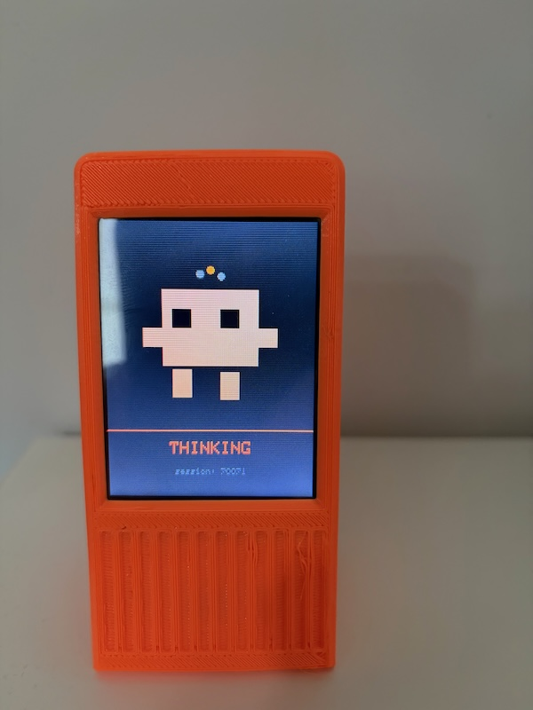

# Claude Monitor

> **Note:** This is my own personal project. I'm not affiliated with, sponsored by, or endorsed by Anthropic. "Claude" and "Clawd" are trademarks of Anthropic.

ESP32-based hardware status display for Claude Code sessions. Shows real-time animated state on a Cheap Yellow Display (CYD), connected via Bluetooth Low Energy. Tap the screen to focus the terminal window that needs your attention.

```
Claude Code hooks --> HTTP POST --> Python daemon --> BLE --> ESP32 display
ESP32 touch       --> BLE --> Python daemon --> AppleScript --> Focus terminal
```

## Features

- **Real-time session state display** — Animated pixel art that reflects what Claude Code is doing (thinking, tool use, waiting for input, errors, etc.). The display updates in real-time as you work.
- **Multi-session support** — When multiple Claude Code sessions are active, the display auto-carousels between them every 5 seconds. Sessions needing attention (permissions, input, errors) automatically take priority.
- **Multi-device support** — Pair multiple displays to one computer (e.g., one at home, one at the office). The daemon automatically connects to whichever device is in range. Each display remembers the computer that first paired with it.
- **Touch interaction** — Tap the screen to focus the terminal window running the displayed session, or cycle to the next session if multiple exist.
- **Wireless firmware updates** — Update the ESP32 firmware over BLE without needing a USB cable (OTA). Flash from CLI with a single command.
- **Terminal identification** — Automatically detects which terminal app is running your Claude Code session (iTerm2, Terminal, Warp, Ghostty, Kitty, Alacritty, WezTerm). Works across multiple tmux sessions and process trees.
- **BLE bonding & owner enforcement** — The display bonds to the computer's BLE adapter on first pairing and rejects connections from other computers, preventing interference in shared spaces.
- **Zero configuration** — No WiFi credentials, no IP addresses, no serial port selection. Auto-pairing on first connect. The daemon starts automatically when you run Claude Code.
- **Multiple board support** — Works with 4 different Cheap Yellow Display variants (ILI9341, ST7789; XPT2046 resistive touch, CST820 capacitive touch).
- **Robust connection handling** — Handles platform differences (Windows WinRT, macOS, Linux) with cached and uncached GATT discovery strategies. Auto-reconnects on disconnect.

## How it works

1. **ESP32** boots and immediately advertises as `"Claude Monitor"` via BLE GATT
2. **Daemon** (`uv run claude-monitor`) scans for that BLE service, auto-connects
3. **Claude Code hooks** fire on session events, POST to the daemon on `localhost:7483`
4. Daemon maps hook events to display states and pushes them to the ESP32 over BLE
5. Tap the touchscreen to send a focus command back — the daemon activates the correct terminal window via AppleScript

Zero configuration. No WiFi credentials, no IP addresses, no serial port selection.

## Setup

### 1. Flash the ESP32

Connect the ESP32 to your computer with a USB-C cable. The initial flash must be done over USB — subsequent updates can be pushed wirelessly via OTA (see below).

Requires [PlatformIO](https://platformio.org/install/cli).

```bash
cd firmware
pio run -e e32r28t -t upload
```

Other board variants:

```bash
pio run -e cyd_standard -t upload   # ESP32-2432S028R (ILI9341 + XPT2046)
pio run -e cyd_v2 -t upload         # V2 dual-USB (ST7789 + XPT2046)
pio run -e cyd_cap -t upload        # Capacitive touch (CST820)
```

Power on the display with any USB power source. It will show a pulsing Bluetooth icon while waiting for a connection.

#### OTA Firmware Updates

After the initial USB flash, you can update the firmware wirelessly over BLE — no cable needed.

**1. Build the new firmware:**

```bash
cd firmware
pio run -e e32r28t          # or your board variant
```

This produces a firmware binary at:
```
firmware/.pio/build/e32r28t/firmware.bin
```

**2. Make sure the daemon is running and BLE-connected:**

```bash
cd daemon
uv run claude-monitor status
```

You should see `BLE connected: yes`.

**3. Push the update:**

```bash
cd daemon
uv run claude-monitor ota ../firmware/.pio/build/e32r28t/firmware.bin
```

The ESP32 reboots automatically when done and the daemon reconnects within a few seconds.

**Important notes:**
- The ESP32 must be connected via BLE — OTA does not work over WiFi
- Flash usage is at ~95% with all features enabled. If the firmware grows significantly, you may need to switch to a larger partition scheme in `platformio.ini` (e.g. `board_build.partitions = min_spiffs.csv`)
- If an OTA update fails mid-transfer, the ESP32 stays on its current firmware — the secondary partition is only activated after a successful write + validation
- The first flash must always be done via USB (`pio run -t upload`)

#### Device Management

Manage which displays are paired to your computer:

```bash
cd daemon

# Show all paired displays
uv run claude-monitor device show

# Remove a specific display (useful if you sell/gift one)
uv run claude-monitor device forget AA:BB:CC:DD:EE:FF

# Clear all pairings and start fresh
uv run claude-monitor device forget
```

When you pair a new display, its address is automatically added to the list. You can have as many displays as you want, but only one connects at a time (whichever is in range).

### 2. Install the Claude Code plugin

Requires [uv](https://docs.astral.sh/uv/) and [Claude Code](https://claude.ai/code).

```bash
# Install as a Claude Code plugin (registers all hooks automatically)
bash hooks/install.sh

# Or install directly via the CLI
claude plugin marketplace add /path/to/claude_monitor
claude plugin install claude-monitor
```

The daemon starts automatically on your first Claude Code session. You can also run it manually:

```bash
cd daemon
uv run claude-monitor
```

**Daemon options:**

```bash
# Enable debug logging to see BLE connection details
uv run claude-monitor --verbose

# Use a different HTTP port (if 7483 is already in use)
uv run claude-monitor --http-port 8000

# Configure how long a session stays on display with no updates (default: 600 seconds)
uv run claude-monitor --stale-timeout 900

# For advanced use: manage multiple displays simultaneously (experimental)
# This connects to N displays at once and broadcasts state to all
uv run claude-monitor --devices 2

# Output logs as JSON for machine parsing
uv run claude-monitor --json-log
```

### 3. Verify the daemon is running

Once installed, the daemon starts automatically when you run Claude Code. Check its status anytime:

```bash
cd daemon
uv run claude-monitor status
```

Example output:
```
BLE connected: yes
Sessions:       2
  abc12  THINKING      my-project
  def45  INPUT         another-project  (5m12s total)
```

If the daemon isn't running, start it manually:
```bash
cd daemon
uv run claude-monitor
```

### 4. Use Claude Code

Start any Claude Code session. The display updates automatically as Claude works. Tap the screen to focus the terminal window when it needs your attention.

## Display States

The display shows a pixel-art character whose expression, color, and animation change to reflect what Claude Code is doing:

| State | Description | Screenshot |
|-------|-------------|------------|
| **Waiting for BLE** | Pulsing Bluetooth icon — waiting for daemon to connect |  |
| **No Sessions** | BLE connected, waiting for a Claude Code session to start |  |
| **IDLE** | Session started, Claude is waiting for your input |  |
| **THINKING** | You submitted a prompt — Claude is thinking |  |
| **TOOL_USE** | Claude is executing a tool (file edits, bash, etc.) |  |
| **PERMISSION** | Waiting for you to approve a permission request — tap to focus |  |
| **INPUT** | Claude finished, waiting for your next prompt — tap to focus |  |
| **ERROR** | API error or tool failure |  |

## Multi-session support

When multiple Claude Code sessions are active, the display auto-carousels between them every 5 seconds. Sessions that need attention (PERMISSION, INPUT, ERROR) automatically take priority and surface to the front. Session indicator dots in the header show which session is currently displayed.

## Multi-device support

If you have multiple Claude Monitor displays (e.g., one at home, one at the office), you can pair them all to the same computer. The daemon will automatically connect to whichever device is in range at any given time — only one device is ever active at a time.

**Setting up multiple displays:**

1. Flash the first display and pair it normally
2. Flash the second display — it will pair automatically (added to the list of known devices)
3. Check which displays are paired:
   ```bash
   cd daemon
   uv run claude-monitor device show
   ```
   Output example:
   ```
   Paired devices (2):
     1. AA:BB:CC:DD:EE:FF
     2. 11:22:33:44:55:66
   ```

4. If you ever want to remove a specific display:
   ```bash
   uv run claude-monitor device forget AA:BB:CC:DD:EE:FF
   ```

5. To clear all pairings and start fresh:
   ```bash
   uv run claude-monitor device forget
   ```

The firmware automatically rejects connections from computers that aren't the "owner" (based on BLE adapter MAC). Each display remembers the first computer that paired with it, so you can safely have multiple displays in your home without them interfering with each other.

## Touch interaction

- **Tap**: Sends a focus command to the daemon, which activates the terminal window running the displayed session. If the current session doesn't need attention and multiple sessions exist, the tap also cycles to the next session.

## Architecture

### ESP32 Firmware (`firmware/`)

C++ with PlatformIO, LovyanGFX for display, ESP32 BLE for communication.

- `ble_protocol` — BLE GATT server with custom service UUID, RX characteristic (daemon writes commands) and TX characteristic (ESP32 notifies tap events)
- `display_manager` — Sprite-based 30fps renderer with state-driven animation selection
- `animation/` — One animation class per state, integer-only math with sin/cos lookup table
- `session_store` — Tracks up to 8 concurrent sessions with priority-based carousel
- `touch_handler` — Debounced tap detection
- `board/` — Compile-time board configs for 4 CYD variants

### Python Daemon (`daemon/`)

asyncio-based, installed with `uv run claude-monitor`. Supports single or multiple displays via the `--devices N` flag.

- `ble_manager` — Uses [bleak](https://github.com/hbldh/bleak) to scan, connect, and communicate with the ESP32. Auto-discovers, bonds, and manages reconnection with platform-specific GATT strategies
- `ble_multi` — Wrapper that manages multiple `BleManager` instances concurrently when `--devices N > 1`
- `pairing` — Persistent list-based storage of known device BLE addresses. Supports multiple devices, auto-migration from old single-address format, selective forget
- `http_server` — Receives hook event POSTs on `localhost:7483`. Serves daemon status at `/status` endpoint
- `session_tracker` — Maps hook events to display states, manages state transitions, tracks active sessions
- `terminal_mapper` — Walks the process tree to find which terminal app runs each session (supports tmux, screen, nested shells)
- `window_focus` — Activates terminal windows via AppleScript (supports iTerm2, Terminal, Warp, Ghostty, Kitty, Alacritty, WezTerm)
- `protocol` — Shared JSON message format constants
- `cli` — Command-line subcommands: `status` (daemon status), `ota` (firmware updates), `device` (pairing management)

### Hook Script (`hooks/`)

Packaged as a Claude Code plugin (`.claude-plugin/plugin.json`). A single bash script is registered for 12 Claude Code events via `hooks/hooks.json`. Reads the hook JSON from stdin and POSTs it to the daemon with TTY/PPID metadata for terminal identification.

## Troubleshooting

**Daemon won't connect to the display:**
1. Verify the ESP32 is powered on and the Bluetooth icon is pulsing (not frozen)
2. Check daemon status: `uv run claude-monitor status`
3. Look for errors in the daemon log: `~/.local/state/claude-monitor/daemon.log`
4. Try resetting the pairing:
   ```bash
   cd daemon
   uv run claude-monitor device forget
   # Power off the display, wait 5 seconds, power on
   # The daemon will auto-pair within 30 seconds
   ```

**Display shows "Waiting for BLE" even though daemon is running:**
- The daemon is not paired to this display. See "Reset the pairing" above.
- Check if the daemon is actually connected: `uv run claude-monitor status` should show `BLE connected: yes`

**Daemon log shows constant disconnect/reconnect:**
- This is normal on first startup — the daemon keeps retrying until the display is powered on
- Once powered on, it should connect within a few seconds and stay connected
- If it keeps reconnecting even when paired, check your BLE adapter (may need to restart macOS/Linux)

**Screen orientation is wrong:**
- Update the board variant in `platformio.ini` to match your hardware (CYD v2 has different orientation than the standard model)
- Rebuild and flash: `pio run -e cyd_v2 -t upload`

**OTA update fails:**
- Verify BLE is connected: `uv run claude-monitor status` → `BLE connected: yes`
- Restart the daemon: kill any running `claude-monitor` process, then restart it
- Ensure you built the firmware with the correct board variant
- Check daemon log for error details

## Uninstall

```bash
bash hooks/uninstall.sh

# Or directly via the CLI
claude plugin uninstall claude-monitor
```

## Compatible hardware

Any ESP32-based Cheap Yellow Display with a 240x320 TFT and touch:

| Board | Display | Touch | Build env |
|-------|---------|-------|-----------|
| E32R28T (LCDWIKI) | ILI9341 | XPT2046 | `e32r28t` |
| ESP32-2432S028R | ILI9341 | XPT2046 | `cyd_standard` |
| ESP32-2432S028 V2 | ST7789 | XPT2046 | `cyd_v2` |
| ESP32-2432S028C | ILI9341 | CST820 | `cyd_cap` |

### Board

This project uses the **E32R28T** (LCDWIKI) board. [Purchase on Amazon](https://www.amazon.se/-/en/dp/B0DRYP7M4K?ref=ppx_yo2ov_dt_b_fed_asin_title) | [Alternate listing](https://www.amazon.se/dp/B0CVQ8LV5W?ref_=pe_111951831_1111173731_i_fed_asin_title&th=1)

| Front | Back |
|-------|------|
|  |  |

### Case

The display fits in the [Aura Smart Weather Forecast Display](https://makerworld.com/en/models/1382304-aura-smart-weather-forecast-display#profileId-1441764) case from MakerWorld.
(Yes, I know I need to make a better quality print.)


