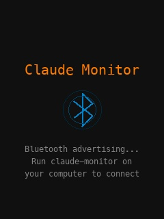
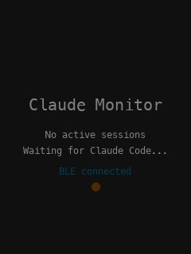
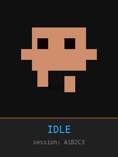
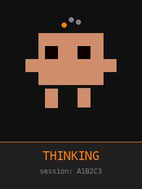
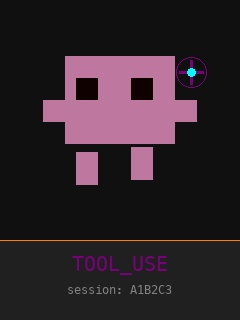
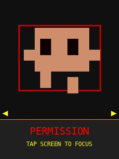
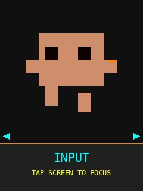
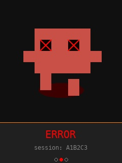
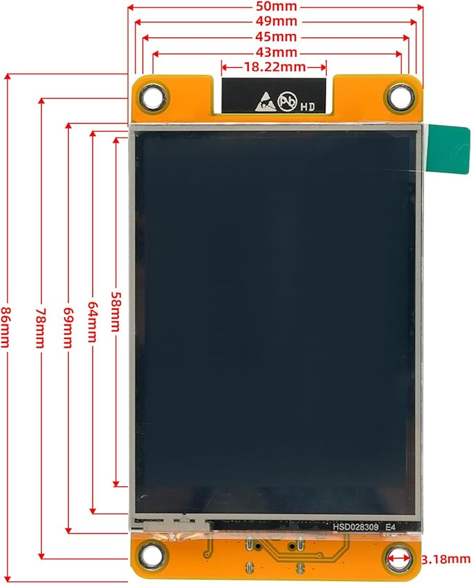
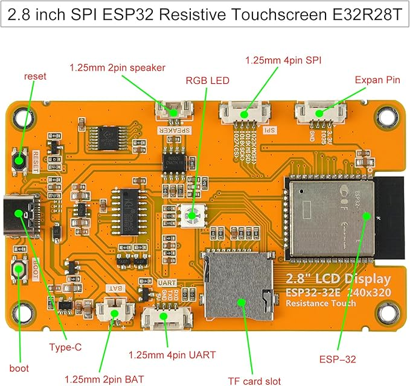

# Claude Monitor

> **Note:** This is my own personal project. I'm not affiliated with, sponsored by, or endorsed by Anthropic. "Claude" and "Clawd" are trademarks of Anthropic.

ESP32-based hardware status display for Claude Code sessions. Shows real-time animated state on a Cheap Yellow Display (CYD), connected via Bluetooth Low Energy. Tap the screen to focus the terminal window that needs your attention.

```
Claude Code hooks --> HTTP POST --> Python daemon --> BLE --> ESP32 display
ESP32 touch       --> BLE --> Python daemon --> AppleScript --> Focus terminal
```

## How it works

1. **ESP32** boots and immediately advertises as `"Claude Monitor"` via BLE GATT
2. **Daemon** (`uv run claude-monitor`) scans for that BLE service, auto-connects
3. **Claude Code hooks** fire on session events, POST to the daemon on `localhost:7483`
4. Daemon maps hook events to display states and pushes them to the ESP32 over BLE
5. Tap the touchscreen to send a focus command back — the daemon activates the correct terminal window via AppleScript

Zero configuration. No WiFi credentials, no IP addresses, no serial port selection.

## Setup

### 1. Flash the ESP32

Requires [PlatformIO](https://platformio.org/install/cli).

```bash
cd firmware
pio run -e e32r28t -t upload
```

Other board variants:

```bash
pio run -e cyd_standard -t upload   # ESP32-2432S028R (ILI9341 + XPT2046)
pio run -e cyd_v2 -t upload         # V2 dual-USB (ST7789 + XPT2046)
pio run -e cyd_cap -t upload        # Capacitive touch (CST820)
```

Power on the display with any USB power source. It will show a pulsing Bluetooth icon while waiting for a connection.

### 2. Install the Claude Code plugin

Requires [uv](https://docs.astral.sh/uv/) and [Claude Code](https://claude.ai/code).

```bash
# Install as a Claude Code plugin (registers all hooks automatically)
bash hooks/install.sh

# Or install directly via the CLI
claude plugin marketplace add /path/to/claude_monitor
claude plugin install claude-monitor
```

The daemon starts automatically on your first Claude Code session. You can also run it manually:

```bash
cd daemon
uv run claude-monitor
```

### 3. Use Claude Code

Start any Claude Code session. The display updates automatically.

## Display States

The display shows a pixel-art character whose expression, color, and animation change to reflect what Claude Code is doing:

| State | Description | Screenshot |
|-------|-------------|------------|
| **Waiting for BLE** | Pulsing Bluetooth icon — waiting for daemon to connect |  |
| **No Sessions** | BLE connected, waiting for a Claude Code session to start |  |
| **IDLE** | Session started, Claude is waiting for your input |  |
| **THINKING** | You submitted a prompt — Claude is thinking |  |
| **TOOL_USE** | Claude is executing a tool (file edits, bash, etc.) |  |
| **PERMISSION** | Waiting for you to approve a permission request — tap to focus |  |
| **INPUT** | Claude finished, waiting for your next prompt — tap to focus |  |
| **ERROR** | API error or tool failure |  |

The RGB LED on the board mirrors the current state color.

## Multi-session support

When multiple Claude Code sessions are active, the display auto-carousels between them every 5 seconds. Sessions that need attention (PERMISSION, INPUT, ERROR) automatically take priority and surface to the front. Session indicator dots in the header show which session is currently displayed.

## Touch interaction

- **Tap**: Sends a focus command to the daemon, which activates the terminal window running the displayed session. If the current session doesn't need attention and multiple sessions exist, the tap also cycles to the next session.

## Architecture

### ESP32 Firmware (`firmware/`)

C++ with PlatformIO, LovyanGFX for display, ESP32 BLE for communication.

- `ble_protocol` — BLE GATT server with custom service UUID, RX characteristic (daemon writes commands) and TX characteristic (ESP32 notifies tap events)
- `display_manager` — Sprite-based 30fps renderer with state-driven animation selection
- `animation/` — One animation class per state, integer-only math with sin/cos lookup table
- `session_store` — Tracks up to 8 concurrent sessions with priority-based carousel
- `touch_handler` — Debounced tap detection
- `board/` — Compile-time board configs for 4 CYD variants

### Python Daemon (`daemon/`)

asyncio-based, installed with `uv run claude-monitor`.

- `ble_manager` — Uses [bleak](https://github.com/hbldh/bleak) to scan, connect, and communicate with the ESP32
- `http_server` — Receives hook event POSTs on `localhost:7483`
- `session_tracker` — Maps hook events to display states
- `terminal_mapper` — Walks the process tree to find which terminal app runs each session
- `window_focus` — Activates terminal windows via AppleScript (supports iTerm2, Terminal, Warp, Ghostty, Kitty, Alacritty, WezTerm)
- `protocol` — Shared JSON message format constants

### Hook Script (`hooks/`)

Packaged as a Claude Code plugin (`.claude-plugin/plugin.json`). A single bash script is registered for 12 Claude Code events via `hooks/hooks.json`. Reads the hook JSON from stdin and POSTs it to the daemon with TTY/PPID metadata for terminal identification.

## OTA Firmware Updates

You can update the ESP32 firmware wirelessly over BLE — no USB cable needed after the initial flash.

### How it works

1. You build the new firmware on your computer
2. The `claude-monitor ota` command sends the binary to the running daemon
3. The daemon pushes it to the ESP32 over BLE in chunks
4. The ESP32 writes it to a secondary flash partition, validates it, and reboots
5. The daemon auto-reconnects to the updated display

### Step-by-step

**1. Build the new firmware:**

```bash
cd firmware
pio run -e e32r28t          # or your board variant
```

This produces a firmware binary at:
```
firmware/.pio/build/e32r28t/firmware.bin
```

**2. Make sure the daemon is running and BLE-connected:**

```bash
cd daemon
uv run claude-monitor status
```

You should see `BLE connected: yes`.

**3. Push the update:**

```bash
cd daemon
uv run claude-monitor ota ../firmware/.pio/build/e32r28t/firmware.bin
```

The command will show progress and the ESP32 will reboot automatically when done. The daemon reconnects within a few seconds.

### Important notes

- The ESP32 must be connected via BLE — OTA does not work over WiFi
- Flash usage is at ~95% with all features enabled. If the firmware grows significantly, you may need to switch to a larger partition scheme in `platformio.ini` (e.g. `board_build.partitions = min_spiffs.csv`)
- If an OTA update fails mid-transfer, the ESP32 stays on its current firmware — the secondary partition is only activated after a successful write + validation
- The first flash must always be done via USB (`pio run -t upload`)

## Uninstall

```bash
bash hooks/uninstall.sh

# Or directly via the CLI
claude plugin uninstall claude-monitor
```

## Compatible hardware

Any ESP32-based Cheap Yellow Display with a 240x320 TFT and touch:

| Board | Display | Touch | Build env |
|-------|---------|-------|-----------|
| E32R28T (LCDWIKI) | ILI9341 | XPT2046 | `e32r28t` |
| ESP32-2432S028R | ILI9341 | XPT2046 | `cyd_standard` |
| ESP32-2432S028 V2 | ST7789 | XPT2046 | `cyd_v2` |
| ESP32-2432S028C | ILI9341 | CST820 | `cyd_cap` |

### Board

This project uses the **E32R28T** (LCDWIKI) board. [Purchase on Amazon](https://www.amazon.se/-/en/dp/B0DRYP7M4K?ref=ppx_yo2ov_dt_b_fed_asin_title) | [Alternate listing](https://www.amazon.se/dp/B0CVQ8LV5W?ref_=pe_111951831_1111173731_i_fed_asin_title&th=1)

| Front | Back |
|-------|------|
|  |  |

### Case

The display fits in the [Aura Smart Weather Forecast Display](https://makerworld.com/en/models/1382304-aura-smart-weather-forecast-display#profileId-1441764) case from MakerWorld.


